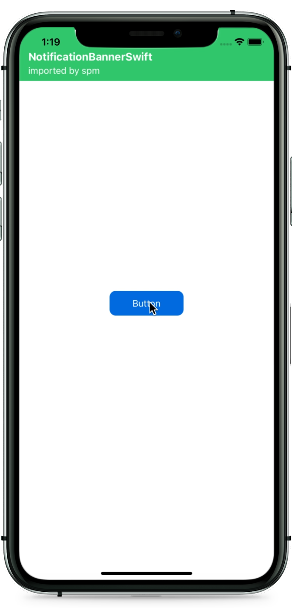

# Simple Dependency
В этом примере рассматривается подключение к проекту зависимости `SwiftNotificationBanner` через SPM. Эта библиотека позволяет отображать на экране баннеры следующим образом: <br>
<p align="center">
  
</p>

### Шаг 1. Добавление зависимости
<p align="center">
  
</p>

### Шаг 2. Выбор версии
<p align="center">
  
</p>

### Шаг 3. Добавление библиотеки к таргету
<p align="center">
  
</p>

### Шаг 4. Использование
```swift
import UIKit
import NotificationBannerSwift

class ViewController: UIViewController {
    @IBAction func buttonTouchUpInside(_ sender: Any) {
        NotificationBanner(
            title: "NotificationBannerSwift",
            subtitle: "imported by spm",
            leftView: nil,
            rightView: nil,
            style: .success,
            colors: nil
        )
        .show(
            queuePosition: .front,
            bannerPosition: .top,
            queue: .default
        )
    }
}
```
