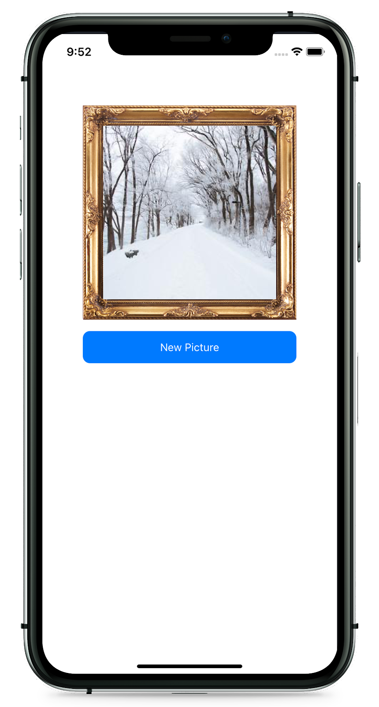
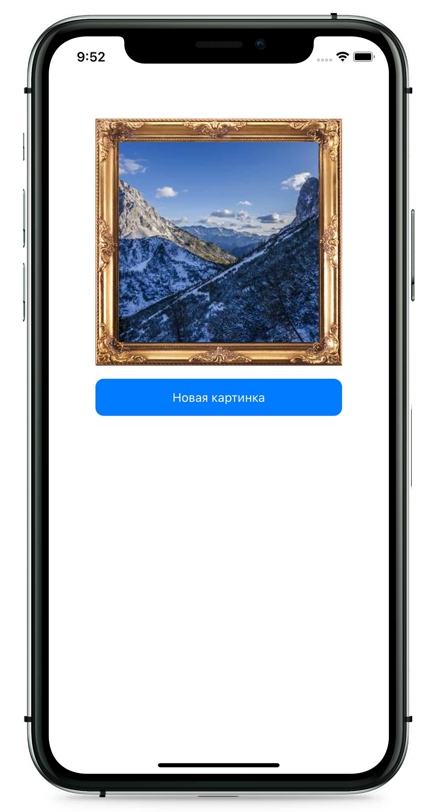

# Bundle With Resources
В этом примере рассматривается создание библиотеки, использующей статические ресурсы в виде картинок и локализации. Библиотека предоставляет пользователю экран с изображением рамки и кнопкой загрузки картинки. При этом название кнопки зависит от локализации.
<p align="center">
  
  
</p>

### Шаг 1. Инициализация
Шаблон библиотеки можно создать с помощью консольной команды:
```bash
swift package init --type library
```

### Шаг 2. Package.swift
При составлении манифеста добавляем:
* `defaultLocalization: "en"`, так как при использовании файлов локализации необходимо указать, какую локализацию нужно использовать по умолчанию
* `platforms: [.iOS(.v11)]`, так как наша библиотека использует `UIKit`
* `dependencies: [.package(url: "https://github.com/SnapKit/SnapKit.git", .upToNextMajor(from: "5.0.1"))]`, так как для верстки используется `SnapKit`
```swift
// swift-tools-version:5.3
import PackageDescription

let package = Package(
    name: "Lib",
    defaultLocalization: "en",
    platforms: [.iOS(.v11)],
    products: [
        .library(
            name: "Lib",
            targets: ["Lib"]
        ),
    ],
    dependencies: [
        .package(url: "https://github.com/SnapKit/SnapKit.git", .upToNextMajor(from: "5.0.1"))
    ],
    targets: [
        .target(
            name: "Lib",
            dependencies: ["SnapKit"]
        ),
    ]
)
```

### Шаг 3. Реализация
Общий вид файловой структуры таргета:
```bash
Lib
├── RandomPictureController
│   └── RandomPictureController.swift
└── Resources
    ├── Images.xcassets
    │   ├── Contents.json
    │   └── frame.imageset
    │       ├── Contents.json
    │       └── frame.png
    └── Localization
        ├── en.lproj
        │   └── Localizable.strings
        └── ru.lproj
            └── Localizable.strings
```

Так как статические ресурсы находятся в папке `Resources`, а их предназначение очевидно по их расширениям - `.lproj`, `.xcassets`, мы не должны особым образом указывать их в `Package.swift`. <br> <br>
Также необходимо помнить, что для доступа к локальным ресурсам модуля нужно использовать конструкцию `Bundle.module`, доступную начиная со Swift 5.3:
```swift
//
//  RandomPictureController.swift
//  

public final class RandomPictureController: UIViewController {
    
    private lazy var getNewPictureButton: UIButton = {
        let button = UIButton(type: .system)

        button.setTitle(
            NSLocalizedString(
                "button.title",
                bundle: .module, // <-- Bundle.module
                comment: "Title of the button"
            ),
            for: .normal
        )

        return button
    }()
    
    private lazy var frameImageView: UIImageView = {
        let imageView = UIImageView()

        imageView.image = UIImage(
            named: "frame",
            in: .module, // <-- Bundle.module
            compatibleWith: nil
        )

        return imageView
    }()
}
```
