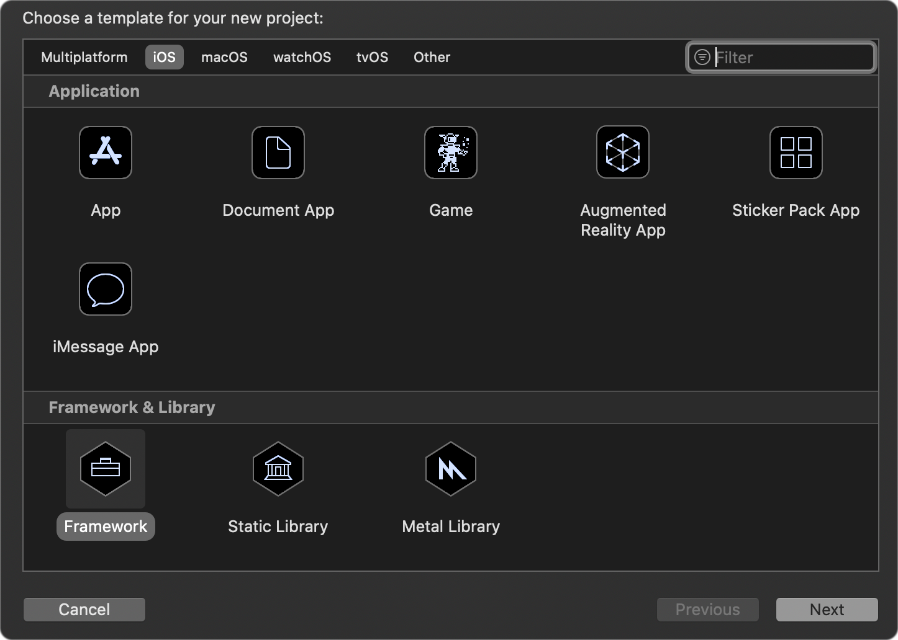
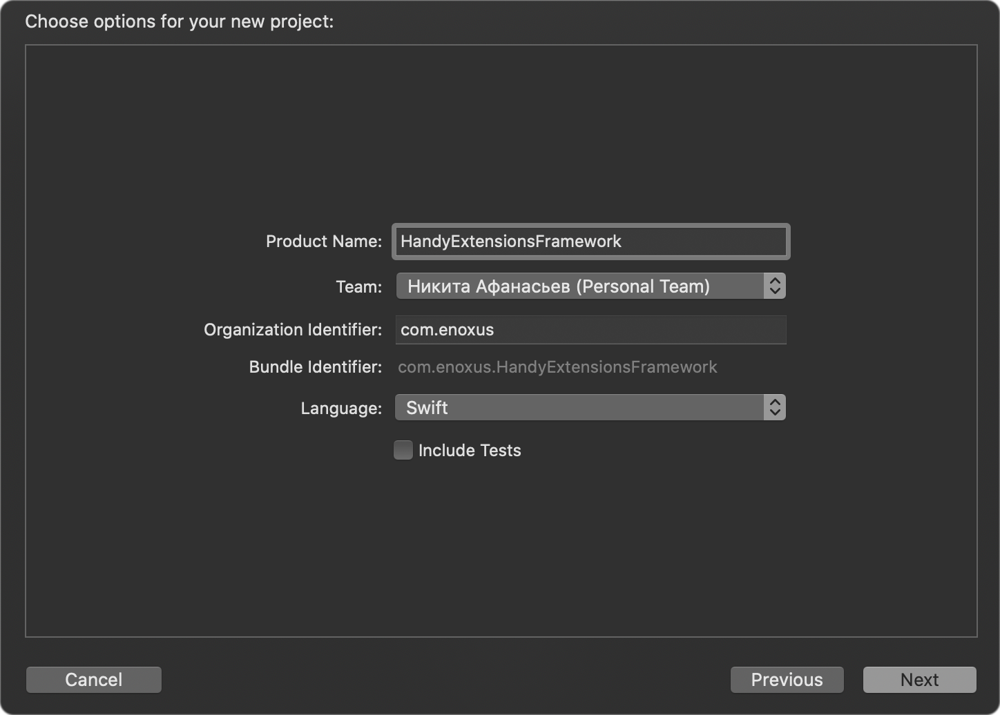
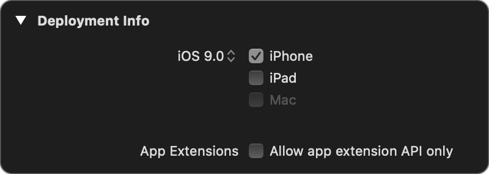
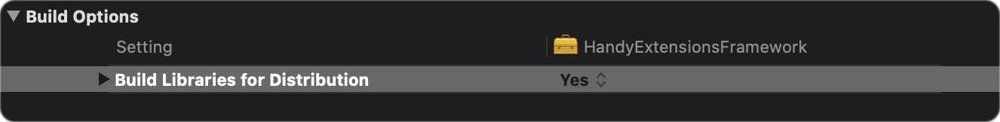
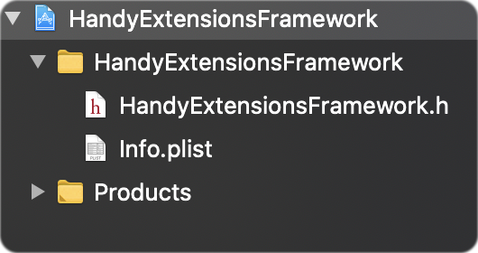

# Binary Frameworks
В этом примере разбирается создание простейшего бинарного фреймворка для двух платформ и его упаковка в контейнер `XCFramework`

### Шаг 1. Создание проекта в XCode
При создании проекта выбираем в верхней части окна платформу `iOS`, и темплейт `Framework`
<p align="center">
  
</p>
После этого вводим название и сохраняем в удобное место
<p align="center">
  
</p>
Устанавливаем ограничения по платформе в настрйках проекта:
<p align="left">
  
</p>
Устанавливаем значение флага `Build Libraries for Distribution` в значение `YES`, для того, чтобы позже работать с XCFramework
<p align="center">
  
</p>
Итоговая файловая структура имеет следующий вид:
<p align="left">
  
</p>

### Шаг 2. Добавляем исходный код
Добавим следующий Swift-файл в директорию фреймворка:
```swift
//
//  IntExtension.swift
//  HandyExtensionsFramework
//
//  Created by Enoxus on 09.03.2021.
//

import Foundation

public extension Int {
    var string: String {
        return "\(self)"
    }
}
```
### Шаг 3. Сборка фреймворков
Осуществим сборку фреймворков под платформы `iOS` и `iOS Simulator`. Для этого воспользуемся командой `xcodebuild archive`, передав в аргументах название таргета, конфигурацию,
целевую платформу, путь выходного файла и необходимые флаги. <br> <br>
Сборка для симулятора:
```bash
xcodebuild archive \
-scheme HandyExtensionsFramework \
-configuration Release \
-destination 'generic/platform=iOS Simulator' \
-archivePath './build/HandyExtensionsFramework.framework-iphonesimulator.xcarchive' \
SKIP_INSTALL=NO \
BUILD_LIBRARIES_FOR_DISTRIBUTION=YES
```
Сборка для iOS:
```bash
xcodebuild archive \
-scheme HandyExtensionsFramework \
-configuration Release \
-destination 'generic/platform=iOS' \
-archivePath './build/HandyExtensionsFramework.framework-iphoneos.xcarchive' \
SKIP_INSTALL=NO \
BUILD_LIBRARIES_FOR_DISTRIBUTION=YES
```

### Шаг 4. Упаковка в XCFramework
Для упаковки скомпилированных фреймворков выполняем следующую команду:
```bash
xcodebuild -create-xcframework \
-framework './build/HandyExtensionsFramework.framework-iphonesimulator.xcarchive/Products/Library/Frameworks/HandyExtensionsFramework.framework' \
-framework './build/HandyExtensionsFramework.framework-iphoneos.xcarchive/Products/Library/Frameworks/HandyExtensionsFramework.framework' \
-output './build/HandyExtensionsFramework.xcframework'
```
В итоге получаем следующую структуру файлов:
```bash
HandyExtensionsFramework.xcframework
├── Info.plist
├── ios-arm64_armv7
│   └── HandyExtensionsFramework.framework
└── ios-arm64_i386_x86_64-simulator
    └── HandyExtensionsFramework.framework
```
### Шаг 5. Интеграция с SPM
Архивируем полученный XCFramework:
```bash
zip HandyExtensionsFramework.xcframework.zip HandyExtensionsFramework.xcframework
```
Загружаем полученный архив на любой хостинг, после чего создаем манифест пакета Package.swift:
```swift
// swift-tools-version:5.3
import PackageDescription

let package = Package(
    name: "HandyExtensionsFramework",
    products: [
        .library(
            name: "HandyExtensionsFramework",
            targets: ["HandyExtensionsFramework"]
        ),
    ],
    dependencies: [],
    targets: [
        .binaryTarget(
          name: "HandyExtensionsFramework",
          url: "https://url.to/HandyExtensionsFramework.xcframework.zip",
          checksum: "" // TODO
        )
    ]
)
```
На данном этапе нам необходима контрольная сумма пакета, чтобы убедиться в том, что пользователи получат действительно верный артефакт. Вычисляем ее следующим образом:
```bash
swift package compute-checksum HandyExtensionsFramework.xcframework.zip
```
Полученное значение устанавливаем в соответствующее поле:
```swift
targets: [
    .binaryTarget(
      name: "HandyExtensionsFramework",
      url: "https://url.to/HandyExtensionsFramework.xcframework.zip",
      checksum: "3074c78131724148e57503c82f8dae97cd76862a0d7776da674bfd1c7705f80c"
    )
]
```
После этого можем разместить полученный Package.swift на любом git-хостинге и подключать библиотеку с помощью XCode или через dependencies в Package.swift
### Шаг 6. Использование
После подключения библиотеки и добавления ее к таргету приложения, можем импортировать ее и использовать предоставляемый ей метод:
```swift
//
//  ViewController.swift
//  FrameworkClient
//
//  Created by Enoxus on 09.03.2021.
//

import UIKit
import HandyExtensionsFramework

class ViewController: UIViewController {

    override func viewDidLoad() {
        super.viewDidLoad()
        print(25.string) // "25"
    }
}
```
А [здесь](https://github.com/ReQEnoxus/HandyExtensionsFramework) можно найти загруженную на GitHub версию фреймворка для теста
